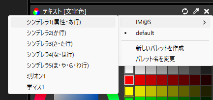
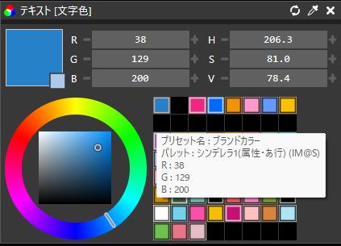

# AviUtl2用カラーパレット（アイドルマスター）

## 概要

ブランドごとに、ブランドカラーや属性色、アイドル個人カラーをカラーパレットとして利用できるようにまとめたものです。

## 使い方

1. `.palette` ファイルを `C:\ProgramData\aviutl2\Default`の中にコピーする
2. AviUtl2を起動し、色設定パネルの🔁ボタンからパレットを選択する
  - 
3. 色を選択する
  - 

## 色の参照先

- シンデレラガールズ
  - [アイドルマスター シンデレラガールズ｜公式ポータルサイト](https://cinderellagirls.idolmaster-official.jp/)
- ミリオンライブ
  - [アニメ『アイドルマスター ミリオンライブ！』公式サイト](https://millionlive-anime.idolmaster-official.jp/)
- 学園アイドルマスター
  - [学園アイドルマスター（学マス）公式サイト](https://gakuen.idolmaster-official.jp/)
  - ほか
